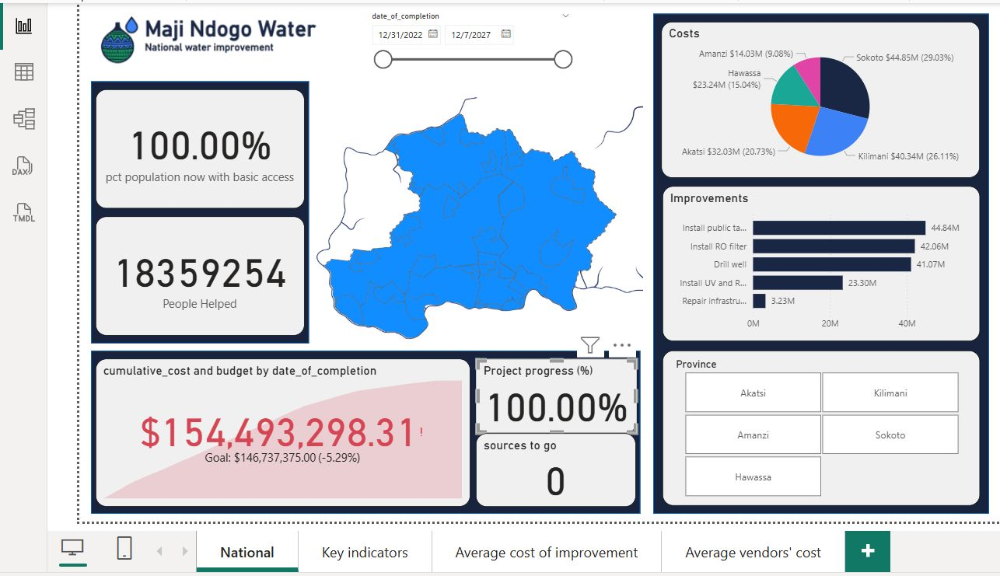
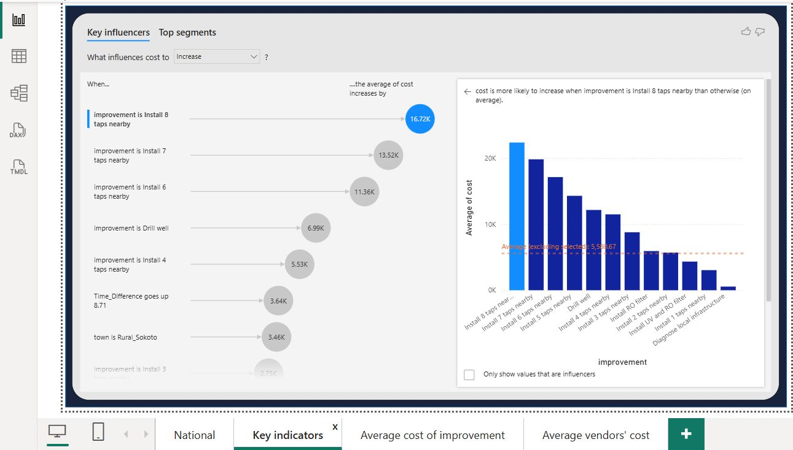
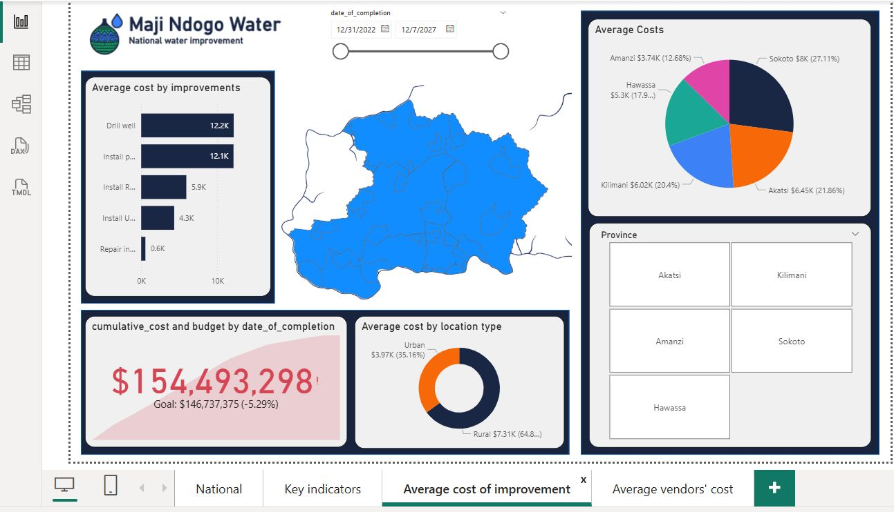
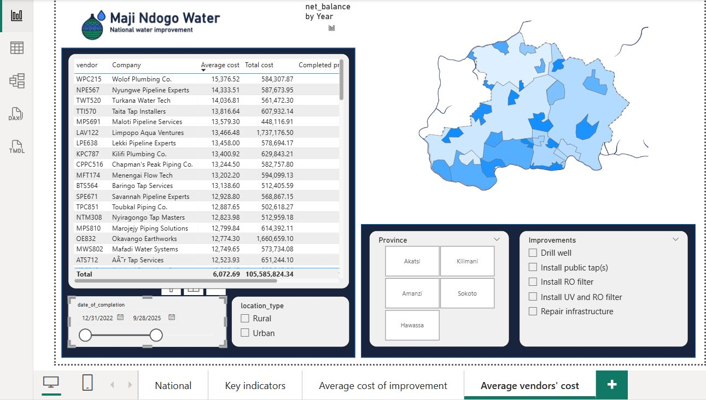

# Maji Ndogo Water Improvement Project

An end-to-end **Data Analytics** and **Business Intelligence** project that analyzes nationwide water infrastructure data using **SQL** and **Power BI** to identify service gaps, prioritize improvement projects, monitor implementation progress, and evaluate financial performance.

The project demonstrates how data can be transformed into actionable insights that support evidence-based decision-making and improve access to safe drinking water across the fictional country of **Maji Ndogo**.

---

## Dashboard Preview



---

## Table of Contents

- [Project Overview](#project-overview)
- [Business Problem](#business-problem)
- [Project Objectives](#project-objectives)
- [Tools & Technologies](#tools--technologies)
- [Database Overview](#database-overview)
- [Project Workflow](#project-workflow)
- [Dashboard Highlights](#dashboard-highlights)
- [Key Insights](#key-insights)
- [Repository Structure](#repository-structure)
- [Project Files](#project-files)
- [How to Use This Repository](#how-to-use-this-repository)
- [Future Enhancements](#future-enhancements)
- [Author](#author)
- [License](#license)

---

# Project Overview

The Maji Ndogo Water Improvement Project demonstrates how SQL and Power BI can be combined to solve real-world infrastructure challenges.

Using relational database analysis and interactive dashboards, the project identifies communities with inadequate water access, prioritizes improvement projects, evaluates project costs, and measures the overall impact of a nationwide clean water initiative.

---

# Business Problem

The Ministry of Water Resources needed answers to several strategic questions:

- Which communities lack reliable access to safe drinking water?
- Which water sources should be prioritized for improvement?
- How efficiently were project funds utilized?
- Which provinces required the greatest investment?
- Which projects generated the highest costs?
- What operational factors influence project expenditure?

---

# Project Objectives

The project was designed to:

- Analyze nationwide water infrastructure data.
- Evaluate water accessibility across five provinces.
- Identify contaminated water sources.
- Assess project costs and budget performance.
- Monitor project implementation.
- Compare rural and urban project costs.
- Build interactive Power BI dashboards.
- Generate data-driven business recommendations.

---

# Tools & Technologies

| Category | Technology |
|-----------|------------|
| Database | MySQL |
| Query Language | SQL |
| Business Intelligence | Power BI |
| Data Modeling | Power Query |
| Documentation | Markdown |
| Version Control | Git & GitHub |

---

# Database Overview

The project uses a relational database consisting of nine primary tables:

- water_source
- location
- visits
- employee
- water_quality
- well_pollution
- auditor_report
- project_progress
- data_dictionary

The **visits** table serves as the operational hub, linking employees, inspection records, water sources, and geographical locations.

---

# Project Workflow

The analysis followed an end-to-end analytics workflow:

1. Data exploration and cleaning
2. Exploratory data analysis
3. Data audit and corruption investigation
4. Water access analysis
5. Infrastructure prioritization
6. Power BI dashboard development
7. Business recommendations
8. Final project reporting

---

# Dashboard Highlights

## Executive Dashboard



The executive dashboard provides high-level KPIs including:

- Population served
- Project completion
- Budget performance
- Water accessibility
- Overall project progress

---

## National Dashboard Overview


Interactive visuals allow stakeholders to monitor:

- Provincial expenditure
- Project progress
- Geographic distribution
- Infrastructure improvements
- Financial performance

---

## Improvement Cost Analysis



This dashboard compares the average cost of each improvement type, helping decision-makers understand where infrastructure investments are most expensive and where cost efficiencies may exist.

---

## Vendor Performance Analysis



Vendor analytics compare contractor performance based on:

- Average project cost
- Total spending
- Number of completed projects

These insights support procurement evaluation and future contractor selection.

---

# Key Insights

The project generated several important business insights:

- Over **18.36 million** people gained access to safe drinking water.
- **100%** of planned improvement projects were completed.
- Universal basic water access was achieved across all five provinces.
- Total expenditure reached **$154.49 million**, compared to a planned budget of **$146.74 million**, resulting in a **5.3%** budget overrun.
- Rural infrastructure projects were significantly more expensive than urban projects.
- Shared public taps served the largest proportion of the population.
- Repairing existing infrastructure was substantially more cost-effective than constructing new systems.
- Project complexity and rural location were identified as the strongest drivers of project cost.

---

# Repository Structure

```text
.
│   README.md
│
├── data/
│
├── docs/
│   ├── business_recommendations.md
│   ├── methodology.md
│   └── project_report.md
│
├── images/
│   ├── average_cost_of_improvement.png
│   ├── average_vendor_costs.png
│   ├── dashboard_overview.png
│   └── key_indicators.png
│
├── powerbi/
│
└── sql/
    ├── 01_data_exploration_and_cleaning.sql
    ├── 02_exploratory_data_analysis.sql
    ├── 03_data_audit_and_corruption_investigation.sql
    └── 04_water_access_analysis.sql
```

---

# Project Files

| Folder | Contents |
|----------|----------|
| **sql/** | Complete SQL analysis scripts |
| **powerbi/** | Interactive Power BI dashboard |
| **docs/** | Project methodology, report, and recommendations |
| **images/** | Dashboard screenshots |
| **data/** | Source datasets (where applicable) |

---

# How to Use This Repository

1. Clone or download the repository.
2. Import the database into MySQL.
3. Execute the SQL scripts in numerical order.
4. Open the Power BI report.
5. Refresh the data model if necessary.
6. Explore the interactive dashboard.
7. Review the supporting documentation in the `docs` folder.

---

# Future Enhancements

Potential future improvements include:

- Automated ETL pipelines
- Real-time dashboard integration
- Predictive maintenance models
- GIS-based geospatial analysis
- Machine learning for project cost forecasting
- Cloud deployment
- Automated reporting with Python

---

# Author

**Chigozie Nnoli**

Data Analyst | Business Intelligence Analyst

**Core Skills**

- SQL
- Power BI
- Python
- Excel
- Data Cleaning
- Data Visualization
- Dashboard Development
- Business Intelligence

---

# License

This repository is intended for educational and portfolio purposes.

Feel free to explore the SQL scripts, and documentation to understand the complete analytical workflow used throughout the project.